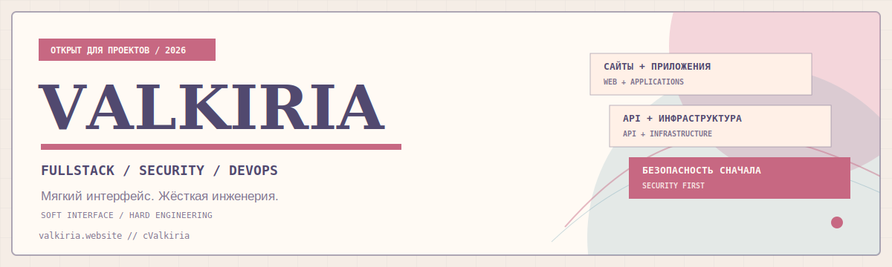

<picture>
  <source media="(prefers-color-scheme: dark)" srcset="./assets/banner-dark.svg">
  <source media="(prefers-color-scheme: light)" srcset="./assets/banner-light.svg">
  
</picture>

<p align="center">
  <a href="#ru">Русский</a>
  ·
  <a href="#en">English</a>
</p>

<p align="center">
  <a href="https://valkiria.website/">
    
  </a>
  <a href="https://t.me/cValkiria">
    
  </a>
  <a href="https://vk.com/cvalkiria">
    
  </a>
</p>

<h3 align="center">Soft interface. Hard engineering.</h3>

<a id="ru"></a>

## Привет, я Valkiria

Fullstack-разработчик с вниманием к безопасности, инфраструктуре и деталям интерфейса.
Создаю сайты, веб-приложения, API и готовлю проекты к реальной работе в production.

- Разрабатываю адаптивные интерфейсы на **React** и **TypeScript**
- Проектирую API, интеграции и backend-сервисы
- Работаю с **Linux**, **Nginx**, **Docker** и Cloudflare
- Проверяю приложения через призму **OWASP** и безопасных настроек
- Использую AI как инженерный ускоритель, а не замену пониманию

```text
> status
ОТКРЫТ ДЛЯ НОВЫХ ПРОЕКТОВ

> focus
WEB / APP / API / SECURITY / DEPLOY
```

## Что я создаю

<table>
  <tr>
    <td width="50%" valign="top">
      <h3>Сайты и приложения</h3>
      <p>Выразительные интерфейсы, которые быстро загружаются, адаптируются под устройства и остаются поддерживаемыми после запуска.</p>
      <code>React</code>
      <code>TypeScript</code>
      <code>Vite</code>
      <code>Responsive UI</code>
    </td>
    <td width="50%" valign="top">
      <h3>Backend и API</h3>
      <p>Понятные контракты, валидация, интеграции, границы авторизации и полезные логи.</p>
      <code>Node.js</code>
      <code>Python</code>
      <code>REST</code>
      <code>SQL</code>
    </td>
  </tr>
  <tr>
    <td width="50%" valign="top">
      <h3>Инфраструктура</h3>
      <p>Деплой, TLS, кеширование и диагностика как полноценная часть разработки.</p>
      <code>Linux</code>
      <code>Nginx</code>
      <code>Docker</code>
      <code>Cloudflare</code>
    </td>
    <td width="50%" valign="top">
      <h3>Безопасность</h3>
      <p>Моделирование угроз, безопасные настройки, security headers и практический hardening.</p>
      <code>OWASP Top 10</code>
      <code>CSP</code>
      <code>Audit</code>
      <code>Hardening</code>
    </td>
  </tr>
</table>

## Технологии

<p>
  
  
  
  
  
  
  
  
  
  
  
  
  
</p>

## Главный проект

<!-- LANDING_BANNER_SLOT: сюда можно добавить ./assets/valkiria-websuite-cover.png -->

### Valkiria WebSuite Landing

Интерактивный landing page для презентации услуг и инженерного подхода.
В нём есть адаптивные темы, RU/EN-локализация, реактивный маскот, Jamendo MiniPlayer,
мини-терминал и развёртывание с security headers.

<p>
  <a href="https://valkiria.website/">
    
  </a>
</p>

`React` `TypeScript` `Vite` `WebGL` `Cloudflare Pages` `CSP`

## Сейчас в фокусе

```text
[01] выразительные интерфейсы без потери доступности
[02] безопасная архитектура API и production-границы
[03] автоматизация деплоя, наблюдаемость и hardening
[04] AI-assisted разработка с обязательной проверкой человеком
```

## Связаться

Есть проект, аудит или техническая задача, которую стоит обсудить?

- **Telegram:** [@cValkiria](https://t.me/cValkiria)
- **VK:** [vk.com/cvalkiria](https://vk.com/cvalkiria)
- **Landing:** [Valkiria WebSuite](https://valkiria.website/)

<p align="right"><a href="#en">Read in English →</a></p>

---

<a id="en"></a>

<details>
<summary><b>English version</b></summary>

<br>

## Hi, I am Valkiria

I am a fullstack developer focused on security, infrastructure and thoughtful interface design.
I build websites, web applications and APIs, then prepare them for real production workloads.

- Building responsive interfaces with **React** and **TypeScript**
- Designing APIs, integrations and backend services
- Working with **Linux**, **Nginx**, **Docker** and Cloudflare
- Reviewing applications through an **OWASP / security** lens
- Using AI as an engineering accelerator, not a replacement for understanding

### What I build

- **Web and applications:** distinctive, responsive and maintainable interfaces
- **Backend and APIs:** clear contracts, validation, integrations and authorization boundaries
- **Infrastructure:** deploy, TLS, caching, diagnostics and Cloudflare
- **Security:** secure defaults, headers, threat-aware architecture and hardening

### Main project: Valkiria WebSuite Landing

An interactive landing page presenting my services and engineering approach.
It includes adaptive themes, RU/EN localization, a reactive mascot, Jamendo MiniPlayer,
terminal commands and security-focused deployment.

<p>
  <a href="https://valkiria.website/">
    
  </a>
</p>

`React` `TypeScript` `Vite` `WebGL` `Cloudflare Pages` `CSP`

### Contact

- **Telegram:** [@cValkiria](https://t.me/cValkiria)
- **VK:** [vk.com/cvalkiria](https://vk.com/cvalkiria)
- **Landing:** [Valkiria WebSuite](https://valkiria.website/)

</details>

<!--
  FUTURE ASSETS
  - assets/valkiria-websuite-cover.png
  - assets/project-security-api.png
  - assets/project-infrastructure.png

  Recommended banner size: 1200x360
  Recommended project card size: 1200x630
-->

<p align="center">
  <sub>Designed and engineered by Valkiria.</sub>
</p>
